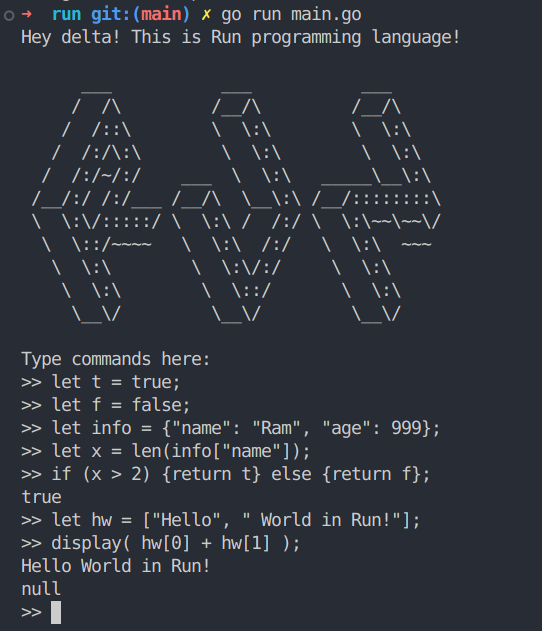

# Run
This is an interpreter for self-made language **Run** in Go.

Supports mathematical expressions, variable binding, functions, conditionals, return statements, higher order functions, closures and arrays.

**Supported Datatypes:** integers, booleans, strings, arrays and hash


To run the interpreter:
```
git clone https://github.com/supremex04/Run.git

go run main.go
```

Built in functions:

```len():```To return the lenght of string, array

```first():```To return first element of array

```last():``` To return last element of array

```rest():``` To display the rest elements

```push():``` To append element into the array

```display():``` To print on the screen


Sample code to run:

```
let t = true;
let f = false;
let info = {"name": "Ram", "age": 999};
let x = len(info["name"]);
if (x > 2) {return t} else {return f};
let hw = ["Hello", " World in Run!"];
display( hw[0] + hw[1] );
```



Followed Thorsten Ball's book on writing interpreters.


